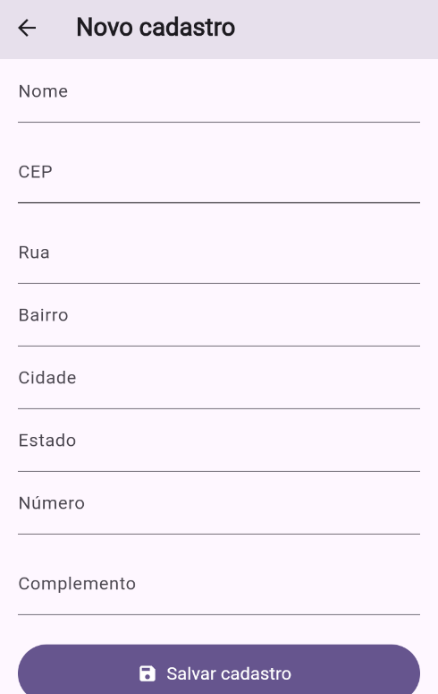
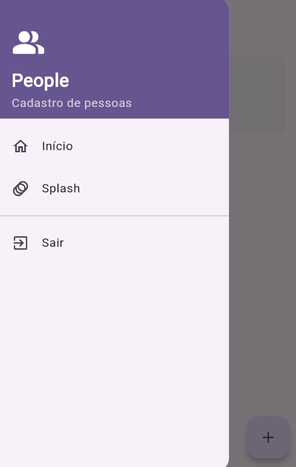

# Aplicativo de Cadastro de Pessoas

Aplicativo mobile desenvolvido para cadastro e gerenciamento local de pessoas, com integração com a API ViaCEP para busca automática de endereços.

---

## Funcionalidades Implementadas

- **RF001 - Tela Splash**:
  - Tela de apresentação inicial com animações suaves de entrada e saída.

- **RF002 - Tela Home**:
  - Cabeçalho personalizado com título da aplicação.
  - Menu lateral estilo *sandwich* (Drawer navigation).
  - Listagem de pessoas cadastradas.
  - Botão flutuante `[+]` para navegação rápida até a tela de novo cadastro.

- **RF003 - Tela de Cadastro**:
  - Campos de entrada editáveis: **Nome**, **CEP**, **Número** e **Complemento**.
  - **Integração com API ViaCEP**: Busca e preenchimento automático dos campos **Rua**, **Bairro**, **Cidade** e **Estado** assim que o CEP é informado.
  - Botão para salvar as informações de cadastro localmente no dispositivo.

---

## Prints

---

## Download do Arquivo `.APK`

Você pode baixar e testar a versão executável do aplicativo diretamente no seu dispositivo Android:

[👉 **Baixar Arquivo APK (Versão 1.0.0)**](https://link-para-download-do-seu-apk.com)

### Como instalar o APK no dispositivo:
1. Faça o download do arquivo `.apk` no celular.
2. Abra o arquivo baixado.
3. Se solicitado, ative a permissão para **"Instalar de fontes desconhecidas"** nas configurações do Android.
4. Siga os passos na tela e conclua a instalação.

---

## Consumo de API Externa

- **ViaCEP**: [https://viacep.com.br/](https://viacep.com.br/)
  - Utilizado para consulta de Código de Endereçamento Postal (CEP) em tempo real.

---

## 🛠️ Tecnologias Utilizadas

- **Linguagem / Framework**: [Ex: React Native / Flutter / Kotlin]
- **Armazenamento Local**: [Ex: Async Storage / SQLite / Room]
- **Requisições HTTP**: [Ex: Axios / Fetch API / Http package]
